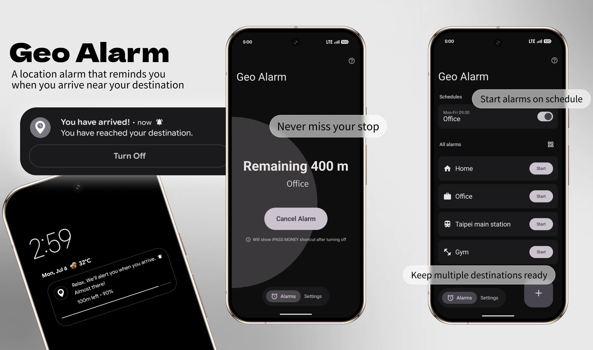

# GeoAlarm




<a href="https://play.google.com/store/apps/details?id=com.github.jimmy90109.geoalarm">
  
</a>

GeoAlarm is a location-based alarm app for Android. Pick a destination, set a radius, and let the app alert you when you get close. It is built for commuters who want to rest on a train or bus without missing their stop.

Traditional Chinese: GeoAlarm 是一款定位鬧鐘 Android App。設定目的地與提醒半徑後，接近目的地時會提醒你，適合通勤、搭車小睡或任何需要「到點再叫我」的場景。

## Features

- Location-based alarms with adjustable trigger radius
- Google Maps destination picker and Google Places search
- Background monitoring with foreground service notifications
- Dynamic location polling that checks less often when far away and increases precision near the destination
- Arrival alert with vibration, optional ringtone, and full-screen arrival screen support
- Headphone-aware ringtone playback to reduce public disturbance
- Alarm schedules for recurring commute routines
- Home screen widget for quickly starting selected alarms
- App shortcuts for creating alarms and schedules faster
- Optional payment app shortcut after arrival, useful for ride-code workflows
- Alarm icons, enable/disable controls, editing, deletion, and undo
- English and Traditional Chinese UI
- Optional AdMob native ads on the home screen when ad support is configured
- Optional anonymous analytics with an in-app opt-out

## Privacy

GeoAlarm uses location permission to detect whether your device has entered the alarm area. Alarm location processing happens on the device.

GeoAlarm does not upload your live location, saved destinations, alarm names, radius settings, or schedule details to a GeoAlarm server. Google Maps Platform may process map and place search usage according to Google's policies, optional AdMob ads may process advertising data according to Google's advertising policies, and optional TelemetryDeck analytics are used only for anonymous stability and usage insights.

Ad-supported builds use Google's User Messaging Platform for consent handling where required. If advertising is enabled, Android advertising ID access is declared with `com.google.android.gms.permission.AD_ID` so Android 13+ devices can provide the advertising ID according to user settings.

Read the full policy: [docs/privacy-policy.html](docs/privacy-policy.html)

## Tech Stack

- Kotlin
- Jetpack Compose and Material 3
- MVVM-style UI state with repository-backed data access
- Hilt for dependency injection
- Room for local alarm and schedule storage
- DataStore for app preferences
- Google Maps SDK, Places SDK, and Play services location
- Google Mobile Ads SDK and User Messaging Platform for optional ad-supported builds
- Foreground services, notifications, geofencing/location monitoring, exact alarms, and widgets
- Android App Functions and app shortcuts for system integrations
- TelemetryDeck for optional anonymous analytics

## Project Structure

```text
app/src/main/java/com/github/jimmy90109/geoalarm/
├── ads/              # AdMob consent, native ad loading, and ad eligibility
├── analytics/        # Optional analytics abstraction and TelemetryDeck implementation
├── appactions/       # App action parsing and use cases
├── appfunctions/     # Android App Functions entry points
├── data/             # Room entities, DAOs, repositories, preferences
├── data/location/    # Current location and permission helpers
├── data/places/      # Google Places search/autocomplete services
├── di/               # Hilt modules
├── navigation/       # Compose navigation routes and host
├── receiver/         # Schedule receivers
├── service/          # Location monitoring and alarm services
├── share/            # Shared place parsing
├── ui/               # Compose screens, components, theme, view models
├── util/             # Permission helpers
├── utils/            # Audio, distance, wake lock, payment shortcut utilities
└── widget/           # Glance app widget
```

## Getting Started

### Prerequisites

- Android Studio
- JDK 17
- Android SDK 36
- Google Maps Platform API key with Maps SDK for Android and Places API enabled

### Setup

1. Clone the repository:

   ```sh
   git clone https://github.com/jimmy90109/geo_alarm.git
   cd geo_alarm
   ```

2. Create or update `local.properties`:

   ```properties
   maps.apiKey=YOUR_GOOGLE_MAPS_API_KEY
   ```

3. Optional: configure TelemetryDeck analytics:

   ```properties
   telemetrydeck.appId=YOUR_TELEMETRYDECK_APP_ID
   ```

   Analytics can also be left unconfigured. See [docs/analytics.md](docs/analytics.md).

4. Optional: configure AdMob for release builds:

   ```properties
   admob.appId=YOUR_ADMOB_APP_ID
   admob.homeNativeAdUnitId=YOUR_HOME_NATIVE_AD_UNIT_ID
   ```

   Debug builds use Google's sample AdMob app ID and native ad unit ID. Release builds enable ads only when both AdMob values are present in `local.properties`; otherwise ad loading remains disabled.

5. Build the debug app:

   ```sh
   ./gradlew assembleDebug
   ```

## Notes for Android Reliability

Location alarms depend on Android location, notification, foreground service, exact alarm, and battery settings. GeoAlarm guides users through the required permissions, but behavior can still vary by device manufacturer and battery policy.

For best reliability, allow precise location, background location, notifications, exact alarms, and unrestricted battery usage when prompted.

## Contributing

1. Create a feature branch from `dev`
2. Submit a pull request to `dev`
3. After testing stability, merge `dev` into `main`

## License

GeoAlarm is released under the [Apache License 2.0](LICENSE).

## History

This project was originally built with Flutter and later rewritten in Kotlin with Jetpack Compose for better Android platform integration and performance. The original Flutter code remains available in Git history.
